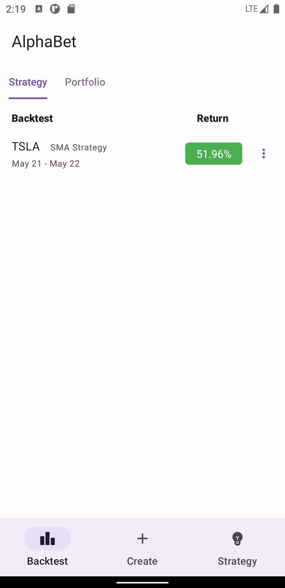

# AlphaBet
One-stop backtest app that covers technical indicator strategies, portfolio, and more.

## Features
* Backtest strategy and portfolio with one tap
* Create your own strategy with more than 10 technical indicators
* Provide in-depth backtest report
* Visualize strategy performance and trade details
* Analyze hedging performance of your portfolio with any security

## Download APK
[AlphaBet.apk](AlphaBet.apk)

## Screenshots

## Libraries Used
* ta4j
* YahooFinanceAPI
* MPAndroidChart
* kotlin-csv